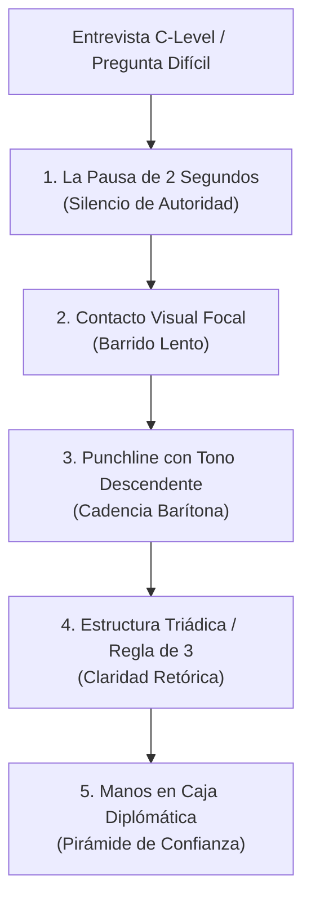

# Playbook Ejecutivo de Storytelling & Coaching C-Level
**Candidato:** Diego Musach (CTO) | **Objetivo:** Posicionamiento C-Level ($11M+ ARS) & Oratoria Diplomática Estilo Obama

---

## 👑 El Método Obama: De Oratoria de Trinchera ("Mono") a Presencia Diplomática

Pasar de expresarse de forma acelerada, rígida o monótona a transmitir la autoridad tranquila de un diplomático internacional o de Barack Obama requiere dominar **5 técnicas físicas y retóricas imperativas**:

---

### Los 5 Pilares de la Oratoria de Barack Obama

#### 1. 🛑 La Pausa de 2 Segundos (El Silencio de Dominio)
* **El error común ("Mono/Acelerado"):** Arrancar a responder instantáneamente mientras se procesa la idea, generando muletillas (*"Eh...", "A ver...", "O sea..."*) o divagaciones.
* **La técnica Obama:** Cuando te hacen la pregunta, **no abras la boca durante 2 segundos completos**. Sostené el contacto visual, asentí levemente con la cabeza y recién ahí comenzá a hablar.
* **El efecto psicológico:** El silencio incomoda al inseguro, pero el verdadero líder demuestra que es dueño del tiempo en la sala. Transmite deliberación y seguridad absoluta.

#### 2. 📉 Inflexión Descendente (Tonalidad Barítona de Autoridad)
* **El error común:** Terminar las frases subiendo la entonación (como si estuvieras haciendo una pregunta o pidiendo aprobación).
* **La técnica Obama:** Cada oración concluye con una **bajada de tono vocal**.
* **Ejemplo:**
  * ❌ *Modo inseguro:* "Convertí la empresa en un negocio rentable regional?" *(Sube el tono al final)*.
  * ✅ *Modo Obama:* "Convertí una operación técnica local en un negocio rentable de escala regional." *(Baja el tono firmemente en 'regional')*.

#### 3. 🔺 La Caja Gestual y la Pirámide de Confianza
* **El error común:** Manos rígidas pegadas al cuerpo o gestos caóticos y desenfrenados por encima de los hombros.
* **La técnica Obama:** Mantener las manos dentro de la "Caja Ejecutivo" (entre el ombligo y el pecho). Cuando hagas una pausa, juntá las yemas de los dedos formando la **Pirámide de Confianza** (Finger Steeple).

#### 4. 📐 La Regla de Tres (Tricolon Retórico)
* **La técnica Obama:** El cerebro humano procesa y recuerda la información en conjuntos de tres.
* **Ejemplo en Pitch C-Level:**
  > *"Mi propuesta como CTO se apoya en tres pilares: **eficiencia de P&L**, **innovación pragmática con IA** y **desarrollo de equipos autónomos**."*

#### 5. 👁️ Contacto Visual Focal (El Barrido Lento)
* **La técnica Obama:** No mires al techo ni muevas los ojos rápido entre personas. Elegí un punto focal (la lente de la cámara o los ojos del entrevistador) y mantené la mirada fija durante una idea completa (10 a 15 segundos) antes de pestañear o pausar.

---

## 🎬 Comparativa Didáctica: Escenario por Escenario (Reel / Video Script)

### Escenario 1: Justificar la Salida tras 20 Años

| Dimensión | ❌ Estilo Rígido / "Trinchera" | 👑 Estilo Diplomático / Barack Obama |
| :--- | :--- | :--- |
| **Inicio Vocal** | Acelerado, arrancando sin pausas: *"A ver, en 21 años el status quo..."* | **Pausa de 2s**, asentimiento lento, respiración profunda diafragmática. |
| **Gesticulación** | Hombros tensos, miradas esquivas al techo. | Manos en la caja ejecutiva, gesticulación expansiva y pausada. |
| **Frase de Cierre** | *"Y nada, sentía que ya no había más para hacer en las dos verticales."* | *"Alcancé mi techo de impacto. Hoy busco una organización donde mi visión mueva la aguja a escala regional."* *(Bajando el tono)* |

---

## 📅 Ruta Didáctica de 14 Días: De Mono a Diplomático

| Día | Foco del Día | Ejercicio Práctico (5 Minutos) |
| :---: | :--- | :--- |
| **Día 1** | El Arte de la Pausa | Grabarte respondiendo una pregunta forzando **3 segundos de silencio** antes de hablar. |
| **Día 2** | Tonalidad Descendente | Leer 5 oraciones del Playbook asegurando que la última palabra caiga en tono barítono grave. |
| **Día 3** | La Caja de Gestos | Grabarte frente al espejo o celular usando únicamente la Pirámide de Confianza al pausar. |
| **Día 4** | Eliminación de Muletillas | Reemplazar todos los *"Eh..."* o *"O sea..."* por silencios absolutos de 1 segundo. |
| **Día 5** | La Regla de Tres | Ensayar tu pitch de presentación dividiéndolo explícitamente en 3 puntos clave. |
| **Día 6** | Toma 1 de Video (Exagerada) | Ejecutar la toma eufórica para soltar músculos faciales y articulación. |
| **Día 7** | Toma 2 de Video (Robótica) | Ejecutar la toma monótona para tomar conciencia de los patrones mecánicos. |
| **Día 8** | Toma 3 de Video (Diplomática) | Integrar pausas, mirada fija y cadencia tranquila en una toma de 90 segundos. |
| **Días 9-14** | Perfeccionamiento & Simulación | Practicar 1 escenario diario en la Web App `cto-pitch-coach`. |

---

## 1. Framework P-A-R (Punchline -> Acción -> Resultado)

El principio fundamental para entrevistas C-Level es: **Conclusión directa primero, evidencia técnica y financiera después**.

---

### Historia 1: Transición Profesional tras 20+ Años (Tu Salida)

* **Punchline (Respuesta directa):**
  > *"Busco dar el siguiente paso porque alcancé mi techo de impacto: convertí una operación técnica local en un negocio rentable y diversificado de escala regional, y hoy busco un desafío donde mi visión de arquitectura estratégica y tracción de negocio muevan la aguja a una escala superior."*
* **Acción (El cómo):**
  > *"Durante mi trayectoria en Bromteck no solo gestioné tecnología; estructuré y lideré dos verticales clave de negocio: Video Broadcast y Energía. Construí equipos técnicos autónomos, optimicé costos operativos con innovación pragmática e impulsé el desarrollo de productos que nos permitieron capturar mercado corporativo masivo."*
* **Resultado (Métricas de impacto):**
  > *"Dejo una estructura técnica madura, altamente eficiente y que opera con márgenes óptimos sin depender de micromanagement, habiendo generado un crecimiento interanual de facturación del 90% en la división de energía."*

---

### Historia 2: Transformación Comercial y Operativa en EDEMSA (Pérdidas de Energía)

* **Punchline (Respuesta directa):**
  > *"Lideré el diseño e implementación de la solución de ingeniería de control de pérdidas eléctricas en baja tensión para EDEMSA, lo que impulsó un crecimiento interanual del 90% en la facturación de nuestra vertical de energía."*
* **Acción (El cómo):**
  > *"Identifiqué las ineficiencias técnicas y contractuales de la red, desarrollé la arquitectura de medición y auditoría bajo normativas de distribución (EPRE), y negocié directamente con la alta gerencia del cliente para asegurar un despliegue ágil sin fisuras operativas."*
* **Resultado (Métricas de impacto):**
  > *"No solo resolvimos un problema técnico crítico de pérdidas no técnicas de energía, sino que transformamos una solución de ingeniería en una línea de ingresos recurrente y de alto margen para nuestra empresa."*

---

### Historia 3: Eficiencia Operativa e Innovación con IA e Infraestructura

* **Punchline (Respuesta directa):**
  > *"Reestructuré el ciclo de vida del software e infraestructura, logrando una reducción del 75% en costos operativos y tiempos de desarrollo mediante la integración de Inteligencia Artificial y la migración estratégica a servidores dedicados."*
* **Acción (El cómo):**
  > *"Audité el gasto recurrente en la nube y los cuellos de botella en el proceso de desarrollo. Implementé herramientas de IA generativa para automatizar la generación de código, pruebas y documentación, e hice un re-platforming a infraestructura on-premise de alto rendimiento."*
* **Resultado (Métricas de impacto):**
  > *"Aceleramos el time-to-market a la mitad, liberamos el 75% del tiempo de los desarrolladores seniors para foco en arquitectura core, y eliminamos costos fijos mensuales en dólares de servicios cloud innecesarios."*

---

### Historia 4: Filosofía de Liderazgo & La Metáfora del Running

* **Punchline (Respuesta directa):**
  > *"Lidero con la disciplina del maratonista: el éxito en tecnología no es el sprint desesperado de una noche sin dormir, sino la cadencia diaria sostenida de un equipo alineado que no afloja el ritmo."*
* **Acción (El cómo):**
  > *"Fomento la autonomía, la claridad de objetivos y la resiliencia ante problemas complejos. Establezco metodologías de trabajo claras donde cada miembro del equipo conoce su impacto directo en el producto final."*
* **Resultado (Métricas de impacto):**
  > *"Mantengo una tasa de rotación prácticamente nula, con equipos de alto rendimiento orientados al cumplimiento estricto de hitos y con capacidad de respuesta inmediata ante imprevistos."*

---

## 2. Matriz de Vocabulario C-Level & Competencias Clave

Reemplazá términos operativos simples por palabras clave de impacto ejecutivo:

| Término Operativo (Evitar) | Vocabulario C-Level (Usar) | Ejemplo en Oración |
| :--- | :--- | :--- |
| "Manejo equipos" | **Desarrollo de equipos de alto rendimiento / Autonomía operativa** | *"Estructuré equipos técnicos autónomos alineados con los objetivos de negocio."* |
| "Ahorré plata" | **Optimización del P&L / Eficiencia de costos (CapEx & OpEx)** | *"Generé una optimización directa en el OpEx recortando un 75% el gasto cloud."* |
| "Hice un proyecto rápido" | **Reducción del Time-to-Market / Agilidad estratégica** | *"Aceleré el time-to-market para capturar oportunidades de mercado antes que la competencia."* |
| "Hablo con clientes" | **Gestión y negociación con Stakeholders C-Level** | *"Alineé las expectativas de los stakeholders garantizando viabilidad técnica y financiera."* |
| "Cambiamos los procesos" | **Gestión del cambio / Reingeniería de procesos** | *"Lideré la gestión del cambio cultural para la adopción de herramientas de IA en ingeniería."* |

---

## 3. Checklist y Preparación para el Lunes 14

### A. Dudas Pendientes para la Sesión con Mariana Castrelos (09:00 hs)
- [ ] **Optimización del Titular de LinkedIn:** ¿Cómo definir la línea descriptiva para equilibrar el seniority de 20 años en Bromteck con la apertura al mercado C-Level? (Ej: *"CTO | Executive Tech Leader | AI Innovation | Scaling Business & P&L Growth"*).
- [ ] **Estrategia Salarial ($11M+ ARS):** ¿Cómo abordar el desglose entre sueldo fijo, bono por desempeño y equity/stock options en rondas iniciales de entrevista?
- [ ] **Mantenimiento del Tono Espontáneo:** ¿Cómo evitar caer en el 'modo robot' cuando la repregunta se vuelve técnica o conceptual?

### B. Plantilla para Reorganizar las Reuniones de tu Equipo el Lunes
> **Asunto:** Reagendamiento operativo por compromiso ejecutivo - Lunes 14
> 
> *"Hola equipo,*
> *Por compromisos de agenda ejecutiva este lunes 14, moveremos el inicio de nuestras reuniones habituales. Arrancaremos puntualmente a las **10:00 hs** (en lugar de las 09:00 hs).*
> *Les pido que aprovechen esa primera hora para avanzar en sus tareas individuales priorizadas y estar listos con el estado de avance a las 10:00.*
> *¡Gracias por la flexibilidad!"*
